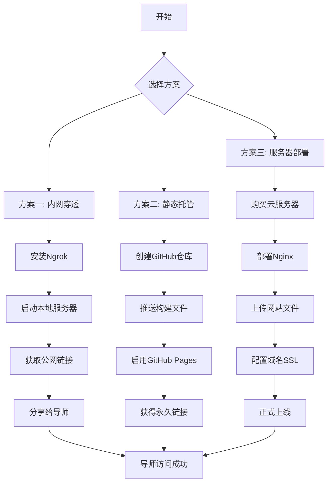

# 课题组网站公网访问方案

## 问题背景
您希望不通过U盘传输文件，让导师通过链接直接访问课题组网站。这意味着需要将网站部署到公网可访问的服务器上。

## 方案概述

根据您的需求和技术复杂度，提供以下三种方案，按推荐顺序排列：

### 方案一：快速临时访问（推荐，最简单）
**适用场景**：导师短期查看，无需长期运行
**技术**：内网穿透工具
**成本**：免费或低成本
**部署时间**：10-30分钟

### 方案二：静态网站托管（中等复杂度）
**适用场景**：长期展示，内容相对固定
**技术**：GitHub Pages / Vercel / 云存储
**成本**：免费或极低
**部署时间**：30-60分钟

### 方案三：完整服务器部署（专业方案）
**适用场景**：长期运行，需要完整功能
**技术**：云服务器 + Nginx + 域名
**成本**：中等（服务器费用）
**部署时间**：2-4小时

---

## 方案一：快速临时访问（内网穿透）

### 1.1 原理说明
内网穿透工具可以将您本地运行的网站暴露到公网，生成一个临时访问链接。导师通过这个链接即可访问您本地运行的网站。

### 1.2 推荐工具

#### 选项A：Ngrok（最稳定）
**特点**：国外服务，稳定可靠，免费版有限制
**步骤**：
1. 访问 https://ngrok.com 注册账号
2. 下载ngrok客户端
3. 获取authtoken并配置
4. 启动本地网站服务器
5. 运行命令暴露端口

```bash
# 1. 启动本地网站（使用Python）
cd frontend/build
python -m http.server 8080

# 2. 在另一个命令行运行ngrok
ngrok http 8080
```

**结果**：获得一个类似 `https://abc123.ngrok.io` 的链接，导师可直接访问。

#### 选项B：Sunny-Ngrok（国内版）
**特点**：国内服务，速度较快，有免费隧道
**步骤**：
1. 访问 https://www.ngrok.cc 注册账号
2. 创建免费隧道（选择http协议，本地端口8080）
3. 下载客户端并配置隧道ID
4. 启动隧道

```bash
# 启动隧道
sunny.exe clientid 您的隧道ID
```

#### 选项C：花生壳（国内老牌）
**特点**：国内服务，有免费版但带宽限制
**步骤**：
1. 下载花生壳客户端
2. 注册账号并实名认证
3. 添加映射（内网IP:8080 → 外网域名）
4. 启动映射

### 1.3 操作步骤（以Ngrok为例）

**步骤1：准备本地网站**
```bash
# 确保网站可以本地访问
cd "e:\VS Coder Projects\课题组网站"
启动网站\启动网站.bat
# 测试本地访问：http://localhost:8080
```

**步骤2：安装配置Ngrok**
```bash
# 下载ngrok（Windows）
# 从 https://ngrok.com/download 下载ngrok.zip
# 解压到任意目录，如 C:\ngrok

# 添加环境变量或将ngrok.exe复制到项目目录
copy C:\ngrok\ngrok.exe "e:\VS Coder Projects\课题组网站\"

# 注册账号获取authtoken
# 访问 https://dashboard.ngrok.com/get-started/your-authtoken
# 复制authtoken

# 配置authtoken
ngrok config add-authtoken 您的authtoken
```

**步骤3：启动内网穿透**
```bash
# 在项目目录打开两个命令行窗口

# 窗口1：启动本地服务器
cd frontend/build
python -m http.server 8080

# 窗口2：启动ngrok
ngrok http 8080
```

**步骤4：获取公网链接**
ngrok启动后会显示：
```
Forwarding    https://abc123.ngrok.io -> http://localhost:8080
```
将 `https://abc123.ngrok.io` 发送给导师即可。

### 1.4 优缺点对比

| 工具 | 优点 | 缺点 | 免费限制 |
|------|------|------|----------|
| Ngrok | 稳定，HTTPS支持 | 国外服务可能慢 | 1个并发连接，链接8小时失效 |
| Sunny-Ngrok | 国内，速度较快 | 需要实名认证 | 2M带宽，每月1GB流量 |
| 花生壳 | 国内老牌，简单 | 免费版限制多 | 1M带宽，每月1GB流量 |

### 1.5 注意事项
1. **保持电脑开机**：内网穿透期间您的电脑必须保持运行
2. **网络稳定**：确保您的网络连接稳定
3. **防火墙**：允许Python和ngrok通过防火墙
4. **时效性**：免费链接通常有时间限制（几小时到几天）

---

## 方案二：静态网站托管

### 2.1 原理说明
将构建好的网站文件（frontend/build目录）上传到静态托管服务，获得永久访问链接。

### 2.2 推荐平台

#### 选项A：GitHub Pages（完全免费）
**步骤**：
1. 创建GitHub账号（如果没有）
2. 创建新仓库，如 `research-center-website`
3. 上传构建文件到gh-pages分支
4. 启用GitHub Pages

```bash
# 1. 初始化Git仓库
cd "e:\VS Coder Projects\课题组网站"
git init

# 2. 创建gh-pages分支
git checkout --orphan gh-pages

# 3. 添加构建文件
git add frontend/build/*
git commit -m "Deploy to GitHub Pages"

# 4. 添加远程仓库并推送
git remote add origin https://github.com/您的用户名/research-center-website.git
git push -u origin gh-pages
```

**访问地址**：`https://您的用户名.github.io/research-center-website`

#### 选项B：Vercel（免费，自动部署）
**步骤**：
1. 访问 https://vercel.com 注册
2. 导入GitHub仓库或直接上传文件夹
3. 自动部署并获得域名

```bash
# 使用Vercel CLI
npm install -g vercel
vercel --prod
```

**访问地址**：`https://research-center-website.vercel.app`

#### 选项C：Netlify（类似Vercel）
**步骤**：拖拽frontend/build文件夹到Netlify网站

#### 选项D：国内云存储（阿里云/腾讯云OSS）
**步骤**：
1. 注册云服务商账号
2. 创建存储桶，开启静态网站托管
3. 上传文件，绑定自定义域名（可选）

### 2.3 操作步骤（以GitHub Pages为例）

**步骤1：准备构建文件**
```bash
# 确保有最新的构建文件
cd frontend
npm run build  # 如果未构建过
```

**步骤2：创建GitHub仓库**
1. 访问 https://github.com/new
2. 仓库名：`research-center-website`
3. 描述：云南省工业废水光催化处理工程技术研究中心网站
4. 选择Public（公开）
5. 不初始化README（因为我们要推送现有文件）

**步骤3：配置Git并推送**
```bash
# 在项目根目录执行
git config --global user.name "您的名字"
git config --global user.email "您的邮箱"

# 初始化仓库
git init
git add .
git commit -m "初始提交"

# 添加远程仓库
git remote add origin https://github.com/您的用户名/research-center-website.git

# 创建并切换到gh-pages分支
git checkout -b gh-pages

# 只保留构建文件，删除其他
# 创建.gitignore文件忽略不需要的文件
# 或者手动整理文件

# 强制推送到gh-pages分支
git push -f origin gh-pages
```

**步骤4：启用GitHub Pages**
1. 访问仓库Settings → Pages
2. Source选择 `gh-pages branch`
3. 等待几分钟，显示绿色提示表示部署成功
4. 访问提供的链接

### 2.4 自定义域名（可选）
如果希望使用专业域名：
1. 购买域名（阿里云、腾讯云等）
2. 在GitHub Pages设置中添加自定义域名
3. 在域名服务商添加CNAME记录

### 2.5 优缺点对比

| 平台 | 优点 | 缺点 | 适用场景 |
|------|------|------|----------|
| GitHub Pages | 完全免费，稳定 | 国内访问可能慢 | 技术展示，文档网站 |
| Vercel | 自动部署，速度快 | 需要GitHub账号 | React项目，快速部署 |
| Netlify | 功能丰富，CDN加速 | 免费版有限制 | 静态网站，表单处理 |
| 云存储OSS | 国内访问快，可控 | 需要备案，有费用 | 国内正式部署 |

---

## 方案三：完整服务器部署

### 3.1 原理说明
租用云服务器，部署完整网站环境，配置域名和SSL证书。

### 3.2 推荐服务商

#### 国内服务商（需要备案）
- **阿里云**：https://www.aliyun.com
- **腾讯云**：https://cloud.tencent.com
- **华为云**：https://www.huaweicloud.com

#### 国外服务商（无需备案）
- **DigitalOcean**：https://www.digitalocean.com
- **Vultr**：https://www.vultr.com
- **AWS/Azure**：大厂服务，功能全面

### 3.3 部署步骤（以阿里云为例）

**步骤1：购买服务器**
- 选择轻量应用服务器（适合初学者）
- 配置：1核2GB，40GB SSD，5M带宽
- 系统：Ubuntu 22.04
- 价格：约100元/月

**步骤2：连接服务器**
```bash
ssh root@服务器IP
```

**步骤3：部署网站**
```bash
# 1. 安装Nginx
apt update && apt install nginx -y

# 2. 上传网站文件（使用scp或FTP）
# 从本地电脑上传
scp -r frontend/build/* root@服务器IP:/var/www/research-center

# 3. 配置Nginx
nano /etc/nginx/sites-available/research-center
```

**Nginx配置**：
```nginx
server {
    listen 80;
    server_name 您的域名或IP;
    
    root /var/www/research-center;
    index index.html;
    
    location / {
        try_files $uri $uri/ /index.html;
    }
    
    # 静态文件缓存
    location ~* \.(js|css|png|jpg|jpeg|gif|ico|svg)$ {
        expires 1y;
        add_header Cache-Control "public, immutable";
    }
}
```

**步骤4：启用网站**
```bash
# 创建符号链接
ln -s /etc/nginx/sites-available/research-center /etc/nginx/sites-enabled/

# 测试配置
nginx -t

# 重启Nginx
systemctl restart nginx
```

**步骤5：配置域名和SSL（可选但推荐）**
```bash
# 安装Certbot
apt install certbot python3-certbot-nginx -y

# 申请SSL证书
certbot --nginx -d 您的域名

# 自动续期测试
certbot renew --dry-run
```

### 3.4 成本估算

| 项目 | 费用 | 说明 |
|------|------|------|
| 服务器 | 100-300元/月 | 根据配置不同 |
| 域名 | 50-100元/年 | .cn域名约50元/年 |
| 备案 | 免费 | 需要时间（约20天） |
| SSL证书 | 免费 | Let's Encrypt |

### 3.5 维护管理

**日常维护**：
```bash
# 更新网站文件
scp -r frontend/build/* root@服务器IP:/var/www/research-center

# 重启Nginx
systemctl restart nginx

# 查看日志
tail -f /var/log/nginx/access.log
tail -f /var/log/nginx/error.log
```

**备份策略**：
```bash
# 每日自动备份
0 2 * * * tar -czf /backup/website_$(date +\%Y\%m\%d).tar.gz /var/www/research-center
```

---

## 方案选择建议

### 根据需求选择

| 需求场景 | 推荐方案 | 理由 |
|----------|----------|------|
| 导师临时查看 | 方案一（内网穿透） | 快速，无需部署，链接分享即可 |
| 长期展示，内容固定 | 方案二（GitHub Pages） | 免费，永久，适合技术展示 |
| 正式上线，需要交互 | 方案三（云服务器） | 完整控制，可扩展，专业 |

### 时间紧迫程度
- **今天就要**：方案一（30分钟内完成）
- **本周内完成**：方案二（1-2小时）
- **长期项目**：方案三（需要备案时间）

### 技术能力要求
- **初学者**：方案一 > 方案二 > 方案三
- **有Git经验**：方案二最合适
- **有服务器经验**：方案三最专业

---

## 操作流程图



---

## 常见问题解答

### Q1: 哪种方案最安全？
**A**: 方案三（服务器部署）最安全，可以配置HTTPS、防火墙等安全措施。方案一和方案二依赖第三方服务的安全性。

### Q2: 导师在国外，哪种方案访问快？
**A**: 
- 方案一（Ngrok）：国外访问快
- 方案二（GitHub Pages/Vercel）：有全球CDN，国外访问快
- 方案三：选择国外服务器商（如DigitalOcean）

### Q3: 网站需要更新内容怎么办？
**A**: 
- 方案一：更新本地文件，重新生成链接
- 方案二：更新文件后重新推送GitHub
- 方案三：上传新文件到服务器

### Q4: 需要备案吗？
**A**: 
- 方案一、二：不需要备案
- 方案三（国内服务器）：需要ICP备案（约20天）

### Q5: 可以同时使用多个方案吗？
**A**: 可以！例如：
1. 先用方案一让导师快速查看
2. 同时准备方案二作为长期展示
3. 未来升级到方案三

### Q6: 遇到"endpoint is already online"错误怎么办？
**A**: 这是Ngrok隧道冲突错误，解决方法：
1. **自动解决**：新版脚本已自动处理，会停止现有隧道
2. **手动解决**：运行命令 `ngrok tunnels kill-all`
3. **使用pooling**：启动时添加 `--pooling-enabled` 参数
4. **等待**：免费隧道8小时后自动过期

---

## 具体操作脚本

### 快速启动脚本（方案一）
创建 `快速分享.bat` 文件：

```batch
@echo off
chcp 65001 >nul
echo.
echo ========================================
echo   课题组网站快速分享工具
echo ========================================
echo.
echo 正在启动本地网站服务器...
start /B python -m http.server 8080
timeout /t 3 /nobreak >nul

echo.
echo 正在启动内网穿透...
echo 请稍等，正在生成公网链接...
echo.
ngrok http 8080
pause
```

### GitHub部署脚本（方案二）
创建 `部署到GitHub.bat` 文件：

```batch
@echo off
chcp 65001 >nul
echo.
echo ========================================
echo   课题组网站GitHub部署工具
echo ========================================
echo.
echo 1. 构建网站...
cd frontend
call npm run build
cd ..

echo.
echo 2. 准备Git部署...
if not exist ".git" (
    git init
    git add .
    git commit -m "初始提交"
)

echo.
echo 3. 请确保已执行以下命令：
echo    git remote add origin https://github.com/您的用户名/research-center-website.git
echo    git checkout -b gh-pages
echo    git push -f origin gh-pages
echo.
echo 4. 然后访问：https://您的用户名.github.io/research-center-website
echo.
pause
```

---

## 总结建议

### 立即行动步骤

1. **今天下午**：使用方案一（Ngrok）生成链接，立即发给导师查看
2. **本周内**：完成方案二（GitHub Pages）部署，获得永久链接
3. **长期规划**：根据导师反馈和实际需求，考虑方案三

### 关键提醒

1. **测试本地运行**：确保 `启动网站.bat` 能正常运行
2. **网络环境**：确保您的网络可以访问外网（方案一需要）
3. **文件准备**：准备好最新的构建文件（frontend/build目录）
4. **导师沟通**：明确告知导师链接的有效期和访问方式

### 技术支持

如果遇到问题：
1. 查看 `内部使用与外部部署指南.md`
2. 查看 `导师查看说明.md`
